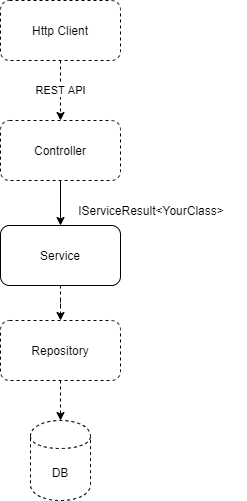

# Service Results

ServiceResult is a slim generic service result library for your service (domain) layer. By using a generic service result, your application will have a good interface towards the service layer. The service layer will also be easy to unit test.

The library consists of ~150 lines of code, is unit tested and proven in use since 2008 at multiple big companies.

## Example usage

Example of a service method in a user service file.

```csharp
public IServiceResult<UsersViewModel> GetUsers(string searchString)
{
    var result = new ServiceResult<UsersViewModel>();
    var users = _userRepository.GetUsers(searchString);

    try
    {
        var response = UsersViewModelFactory.Create(users);
        return result.Ok(response);
    }
    catch (Exception)
    {
        return result.Error(message: "Failed to get users");
    }
}
```

Corresponding call to the service method from a Controller.
```csharp
[HttpGet]
public ActionResult<UsersViewModel> GetUsers(string searchString)
{
    var result = _userService.GetUsers(searchString);

    return result.IsSuccessCode
        ? Ok(result.Data)
        : StatusCode(result.Code, result.Data);
}
```

## Example of the service layer in a RESTful microservice



## Getting started

ServiceResult is available as NuGet, https://www.nuget.org/packages/Mimiware.ServiceResult/.
