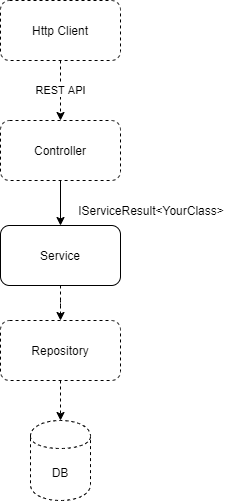

[](https://coveralls.io/github/mimiware/serviceresult?branch=main)

[](https://sonarcloud.io/dashboard?id=mimiware_serviceresult)

# ServiceResult — Result Pattern for .NET

**ServiceResult** implements the [Result Pattern](https://www.milanjovanovic.tech/blog/functional-error-handling-in-dotnet-with-the-result-pattern) for .NET — a proven alternative to exception-based error handling in your service (domain) layer.

Instead of throwing exceptions for expected failures, your service methods return a `ServiceResult` that carries a status code, optional data, and error details. This creates a clean, testable interface between your presentation and domain layers.

The library is ~150 lines of code, 100% unit tested, and has been battle-tested since 2008 in critical enterprise systems at multiple large companies.

## Why ServiceResult?

- **Eliminates exception-driven control flow** — No more try/catch in controllers for expected errors like "not found" or "validation failed"
- **HTTP status codes built-in** — `ServiceResultCode` maps directly to HTTP status codes (200, 404, 500, etc.), making REST API integration seamless
- **Easy to unit test** — Assert on `IsSuccessCode`, `Code`, `Data`, and `ErrorMessage` instead of catching exceptions
- **Minimal footprint** — ~150 lines of code with zero dependencies, nothing to learn, nothing to configure
- **Works with any architecture** — Clean Architecture, Onion Architecture, Vertical Slice, CQRS, or traditional layered

### Comparison with alternatives

| Feature | ServiceResult | FluentResults | ErrorOr | Raw Exceptions |
|---------|:---:|:---:|:---:|:---:|
| Lines of code | ~150 | ~2000+ | ~800+ | 0 |
| HTTP status codes built-in | Yes | No | No | No |
| Learning curve | Minimal | Moderate | Moderate | None |
| Zero dependencies | Yes | Yes | Yes | N/A |
| Proven since | 2008 | 2019 | 2022 | N/A |

## Installation

Add via .NET CLI:
```
dotnet add package Mimiware.ServiceResult
```

Or via Package Manager:
```
Install-Package Mimiware.ServiceResult
```

Or directly in your .csproj:
```xml
<PackageReference Include="Mimiware.ServiceResult" Version="1.4.1" />
```

## Quick start

### Service layer — return results instead of throwing

```csharp
public class UserService : IUserService
{
    public IServiceResult<UsersViewModel> GetUsers(string searchString)
    {
        var result = new ServiceResult<UsersViewModel>();

        try
        {
            var users = _userRepository.GetUsers(searchString);
            var response = UsersViewModelFactory.Create(users);
            return result.Ok(response);
        }
        catch (Exception)
        {
            return result.Error(message: "Failed to get users");
        }
    }

    public IServiceResult<UserViewModel> GetById(int id)
    {
        var result = new ServiceResult<UserViewModel>();

        var user = _userRepository.GetById(id);
        if (user == null)
            return result.Error(ServiceResultCode.NotFound, "User not found");

        return result.Ok(UserViewModelFactory.Create(user));
    }
}
```

### Controller — check `IsSuccessCode` and map to HTTP responses

```csharp
[HttpGet]
public ActionResult<UsersViewModel> GetUsers(string searchString)
{
    var result = _userService.GetUsers(searchString);

    return result.IsSuccessCode
        ? Ok(result.Data)
        : StatusCode(result.Code, result.ErrorMessage?.ErrorMessage);
}
```

### Unit testing — assert on result properties

```csharp
[Fact]
public void GetUsers_WhenSuccessful_ReturnsOkWithData()
{
    // Arrange
    var service = new UserService(mockRepository);

    // Act
    var result = service.GetUsers("search");

    // Assert
    Assert.True(result.IsSuccessCode);
    Assert.Equal(ServiceResultCode.Ok, result.Code);
    Assert.NotNull(result.Data);
}

[Fact]
public void GetById_WhenNotFound_ReturnsNotFoundError()
{
    // Arrange
    var service = new UserService(mockRepository);

    // Act
    var result = service.GetById(999);

    // Assert
    Assert.False(result.IsSuccessCode);
    Assert.Equal(ServiceResultCode.NotFound, result.Code);
    Assert.Equal("User not found", result.ErrorMessage.ErrorMessage);
}
```

## Available status codes

`ServiceResultCode` provides pre-defined constants that map to HTTP status codes:

| Success (2xx) | Client Error (4xx) | Server Error (5xx) |
|---|---|---|
| `Ok` (200) | `BadRequest` (400) | `InternalError` (500) |
| `OkCreated` (201) | `UnAuthorized` (401) | `BadGateway` (502) |
| `OkNoContent` (204) | `PaymentRequired` (402) | `ServiceUnavailable` (503) |
| | `Forbidden` (403) | |
| | `NotFound` (404) | |
| | `MethodNotAllowed` (405) | |
| | `Conflict` (409) | |
| | `Gone` (410) | |

## When to use ServiceResult

- **Service/domain layer methods** that need to communicate success or failure to the caller
- **REST APIs** where service result codes map directly to HTTP response codes
- **CQRS command/query handlers** returning operation outcomes
- **Any layered architecture** where you want a consistent interface between layers

## When NOT to use ServiceResult

- **Truly exceptional situations** (out of memory, stack overflow) — use exceptions
- **Internal private methods** that only your own class calls — keep it simple
- **Simple CRUD with no business logic** — if there's nothing that can go wrong, you don't need a result wrapper

## Architecture context



## Examples

See the [Examples](Examples/) folder for complete working projects:
- [.NET 8 REST API](Examples/Example.Net8.RestApi.Backend/) — Modern .NET 8 example with dependency injection, services, and controllers
- [.NET Core 3.1 REST API](Examples/Example.NetCore31.RestApi.Backend/) — Legacy example

## Links

- [NuGet Package](https://www.nuget.org/packages/Mimiware.ServiceResult/)
- [GitHub Repository](https://github.com/mimiware/serviceresult)
- [SonarCloud Dashboard](https://sonarcloud.io/dashboard?id=mimiware_serviceresult)
